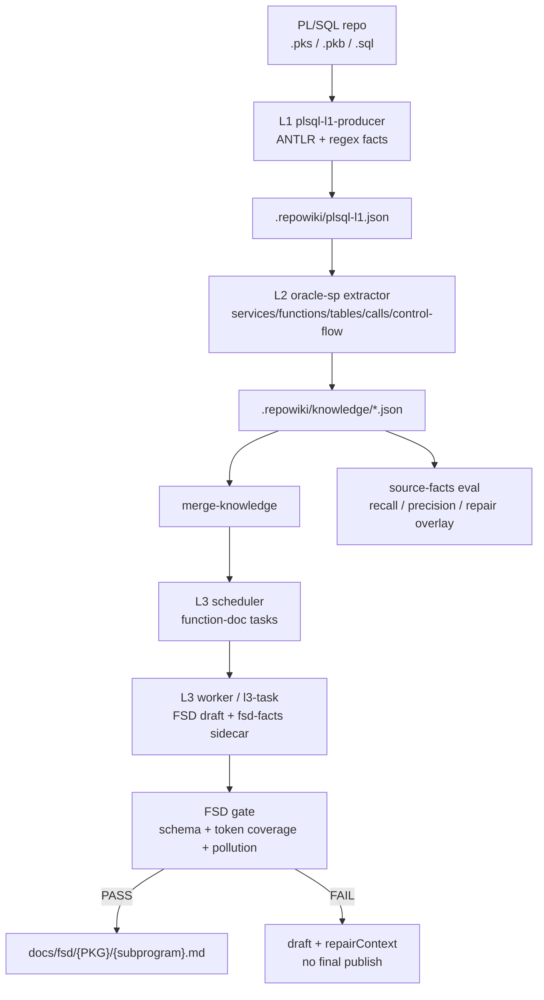
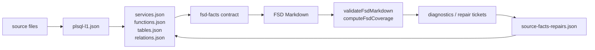

# Repowiki SQL Main

Repowiki SQL Main 是面向 lingxicode 离线包的 Oracle PL/SQL 存过 FSD 技能插件包。它只聚焦存过迁移前的 FSD 事实抽取、文档生成和验收，不包含 Dubbo、工行功能清单、UA 或 Java 生成链路。

> 重要：本项目不是独立 App。运行前必须把本包内容合并到 lingxicode 根目录下，并从 lingxicode 根目录执行命令。
> 不能假设使用方已有 codegraph、opencode、parsers 或 PL/SQL parser 依赖；这些运行时依赖必须由本发布包随包携带。
> 使用方不需要、也不应该再去下载 codegraph/opencode/parsers。缺少任一必需运行时文件，都应视为发布包制作不完整，需要重新补齐发布包。

## 目标

输入一个以 `.pks`、`.pkb`、`.sql` 为主的 PL/SQL 仓库，输出可供后续 SQL/存过转 Java 使用的中间 FSD：

- L1：解析 PL/SQL 源码，形成 `.repowiki/plsql-l1.json` 事实底座。
- L2：从 L1 和源码结构抽取 Package、Procedure、Function、参数、返回值、表操作、列、调用、控制流、异常、事务、特殊语法等事实。
- L3：基于 `wiki-l3-oracle-sp` skill 生成 `docs/fsd/{PKG}/{subprogram}.md`。
- Gate：校验 FSD 是否覆盖必须事实，缺失时保留 draft 并输出 repair context，不把未通过文档混入 final。
- Eval：提供 source-to-facts、FSD schema、Markdown coverage、污染检测、mutation、AB、GitHub corpus 等验收脚本。

## 架构



## 数据流



## 目录说明

```text
config/skills/repowiki/SKILL.md      主 Skill 入口；lingxicode 识别 repowiki 从这里开始
config/skills/wiki-l3-oracle-sp/     Oracle 存过 FSD 业务规约包；由 scheduler 按 oracle-sp profile 自动加载

config/bin/codegraph/
  node.exe                          CodeGraph/Node 运行时；必须随包携带
  dist/bin/codegraph.js             CodeGraph CLI；必须随包携带

bin/opencode.exe                    L3 worker 默认 runner；必须随包携带，使用 Git LFS 存储
lingxicode.bat                      SQL 发布包离线启动脚本，设置 parsers/codegraph/opencode config 环境变量
config/opencode.json                LLM provider/model 配置模板；原目录真实 key 不入库，使用方按环境配置
parsers/                            CodeGraph parser 资源；必须随包携带

config/skills/repowiki/
  repowiki-run.cjs                 端到端编排入口
  repowiki-codegraph-init.cjs      L1 启动入口；PL/SQL 仓库会转到 plsql-l1-producer
  list-services.cjs                profile 匹配与模块枚举
  repowiki-l2.cjs                  L2 抽取；oracle-sp 分支处理存过
  merge-knowledge.cjs              合并 L2 parts
  repowiki-l3-scheduler.cjs        L3 任务生成
  repowiki-l3-dispatcher.cjs       L3 worker 滚动调度
  repowiki-l3-task.cjs             L3 claim/done/gate 协议
  plsql-source-facts-*.cjs         source-to-facts 评测与 GitHub corpus
  fsd-*.cjs                        FSD 评测、污染检测、mutation、AB、严格验收
  lib/plsql-l1-producer.cjs        PL/SQL L1 事实抽取
  lib/fsd-*.cjs                    FSD facts 编译、渲染、coverage、gate、schema
  lib/source-facts-repairs.cjs     L2 repair overlay
  profiles/oracle-sp.json          存过 profile
  eval/                            正负例、golden、mutation、GitHub corpus 验收集
  tests/                           自动化测试
  vendor/                          PL/SQL parser 离线依赖，必须包含 node_modules

config/skills/wiki-l3-oracle-sp/
  SKILL.md                         存过 FSD 业务规约；不是手工运行入口
  rules/                           FSD 生成、控制流、转化映射规则
  templates/                       FSD 模板
  validation.json                  存过 FSD 语义校验口径
```

## 离线依赖

本包的离线运行依赖分两类，均应由发布包提供：

1. 插件内依赖：`config/skills/repowiki/vendor/node_modules`，用于本地离线执行 PL/SQL parser。
2. lingxicode 运行时依赖：`config/bin/codegraph`、`bin/opencode.exe`、`lingxicode.bat`、`parsers`、`config/opencode.json`。

发布给其他 lingxicode 环境时，不能只提供 `config/skills`。很多目标环境没有 codegraph/opencode，这些依赖必须随本包一起提供。若以下检查失败，说明当前包不是可运行包；处理方式是重新制作/补齐发布包，不是让使用方手工联网下载：

```powershell
Test-Path .\config\bin\codegraph\node.exe
Test-Path .\config\bin\codegraph\dist\bin\codegraph.js
Test-Path .\config\skills\repowiki\vendor\node_modules
Test-Path .\parsers
Test-Path .\bin\opencode.exe
Test-Path .\lingxicode.bat
Test-Path .\config\opencode.json
```

也可以直接运行：

```powershell
npm run preflight
```

`bin/opencode.exe` 大于 GitHub 普通单文件限制，发布包使用 Git LFS 保存。维护人员推送仓库前必须确认 `.gitattributes` 已跟踪 `bin/opencode.exe`，并确认 `git lfs ls-files` 能看到它。

L3 文档生成涉及大模型 worker，必须配置可用模型。`repowiki-l3-dispatcher.cjs` 默认读取随包提供的 `config/opencode.json`，也可运行时传 `--model <provider/model>`。
原已跑通目录的 `config/opencode.json` 包含真实模型地址/API Key，不能提交到 GitHub；本发布包提供可编辑模板。使用方只需要填入本地可用的模型/provider/API Key 或内网模型配置，不需要下载 runner。
如果模型未配置，L3 worker 不能启动；这不是 FSD 规则问题，而是运行时配置未完成。

仅发布包维护人员需要重新安装 vendor 依赖；普通使用方不执行这一步：

```powershell
cd config\skills\repowiki\vendor
npm ci
```

## 端到端使用

先确认当前目录是 lingxicode 根目录，且已经合并本插件包：

```powershell
pwd
Test-Path .\config\skills\repowiki\repowiki-run.cjs
Test-Path .\config\skills\wiki-l3-oracle-sp\SKILL.md
Test-Path .\config\bin\codegraph\node.exe
npm run preflight
```

### 主入口怎么理解

本包的手工入口只有一个，不是新写一套独立 skill：

```text
config/skills/repowiki/SKILL.md
  主 Skill 入口。负责 L1 -> L2 -> merge -> L3 scheduler -> L3 dispatcher 的完整流程。
  命令入口是 config/skills/repowiki/repowiki-run.cjs。

config/skills/wiki-l3-oracle-sp/
  原目录已有的 Oracle 存过 FSD 业务规约包，负责模板、规则、校验口径。
  它不是手工直接跑的主入口；scheduler 在识别 profile=oracle-sp 后会自动加载它。
```

所以正常使用只跑主编排入口。全新项目端到端执行用：

```powershell
node config\skills\repowiki\repowiki-run.cjs D:\path\to\plsql-repo
```

如果目标仓库已有 `.repowiki/run-summary.json`，命令会从 `currentStage` 自动续跑。需要强制从第一阶段重新跑完整端到端时，才使用：

```powershell
node config\skills\repowiki\repowiki-run.cjs D:\path\to\plsql-repo --from l1
```

`--from l1` 的含义是“把起点设为 L1 后继续跑完整状态机”，不是只跑 L1。源码中 `repowiki-run.cjs` 会按 `l1 -> list -> l2 -> merge -> l3sched -> l3disp -> done` 继续推进。只想单独调试 L1 时才手工运行 `repowiki-codegraph-init.cjs`。

不要手工直接“调用” `wiki-l3-oracle-sp/SKILL.md`。它会被 L3 task 的 `businessContext` 注入给 worker。

源码对应关系：

- `config/skills/repowiki/repowiki-l3-scheduler.cjs` 中 `oracle-sp` profile 自动映射到 `wiki-l3-oracle-sp`。
- `config/skills/wiki-l3-oracle-sp/manifest.json` 声明 `docsDir: "fsd"`。
- `config/skills/repowiki/lib/l3-skill-contract.cjs` 会把 `docsDir` 拼成 `<仓根>/docs/<docsDir>`，所以当前源码实际发布目录是 `<仓根>/docs/fsd/`。

以一个 PL/SQL 项目为输入：

```powershell
node config\skills\repowiki\repowiki-run.cjs D:\path\to\plsql-repo
```

产物位置：

```text
D:\path\to\plsql-repo\.repowiki\plsql-l1.json
D:\path\to\plsql-repo\.repowiki\knowledge\functions.json
D:\path\to\plsql-repo\.repowiki\diagnostics\
D:\path\to\plsql-repo\docs\fsd\{PKG}\{subprogram}.md
```

如果有人工 golden，可在进入 L3 前开启 source facts gate：

```powershell
node config\skills\repowiki\repowiki-run.cjs D:\path\to\plsql-repo --source-facts-golden D:\path\to\golden.json
```

只跑 source facts gate：

```powershell
node config\skills\repowiki\repowiki-run.cjs D:\path\to\plsql-repo --source-facts-gate-only --source-facts-golden D:\path\to\golden.json
```

## 分阶段调试

```powershell
# L1: 生成 .repowiki/plsql-l1.json
node config\skills\repowiki\lib\plsql-l1-producer.cjs D:\path\to\plsql-repo

# 模块枚举
node config\skills\repowiki\list-services.cjs D:\path\to\plsql-repo --profile oracle-sp

# L2: 生成 .repowiki/knowledge/parts/*.json
node config\skills\repowiki\repowiki-l2.cjs D:\path\to\plsql-repo --all --profile oracle-sp

# 合并 L2 facts
node config\skills\repowiki\merge-knowledge.cjs D:\path\to\plsql-repo\.repowiki\knowledge

# L3 调度
node config\skills\repowiki\repowiki-l3-scheduler.cjs D:\path\to\plsql-repo --l3-skill wiki-l3-oracle-sp --concurrency 20

# L3 执行
node config\skills\repowiki\repowiki-l3-dispatcher.cjs D:\path\to\plsql-repo
```

如需指定模型：

```powershell
node config\skills\repowiki\repowiki-l3-dispatcher.cjs D:\path\to\plsql-repo --model provider/model
```

## 验收

运行全部测试：

```powershell
npm test
```

只跑 source-to-facts 验收：

```powershell
npm run test:source-facts
```

只跑 FSD contract / renderer / gate 验收：

```powershell
npm run test:fsd
```

严格端到端验收：

```powershell
npm run acceptance
```

## Gate 规则

FSD final 发布前必须满足：

- `fsd-facts` schema 合法。
- Markdown 固定 6 个二级章节。
- Package、Subprogram、Kind、Signature、Param、Return、Table、Operation、Column、Call、Sequence、Constant、ControlFlow、Exception、Transaction、SpecialSyntax、ManualReview、SourceTrace 等事实必须被覆盖。
- SQL alias、伪表名、裸临时变量等污染项不得进入 table mappings。
- 缺失事实时只能产 draft 和 repairContext，不能发布 final。

## 不包含的内容

- 不包含 Dubbo / DSF / HTTP 服务清单链路。
- 不包含工行功能清单中文命名规则。
- 不包含 UA / Understand Anything。
- 不包含 SQL/存过转 Java 的最终 Java 代码生成，只冻结 FSD 消费合同。
