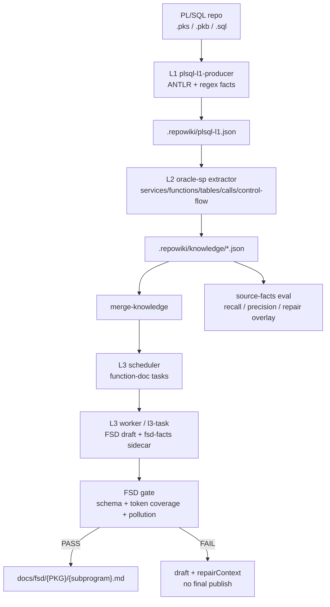
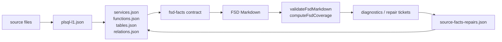

# Repowiki SQL Main

Repowiki SQL Main 是 Oracle PL/SQL 存储过程到中间 FSD 的端到端链路。它只聚焦存过迁移前的 FSD 事实抽取、文档生成和验收，不包含 Dubbo、工行功能清单、UA 或 Java 生成链路。

## 目标

输入一个以 `.pks`、`.pkb`、`.sql` 为主的 PL/SQL 仓库，输出可供后续 SQL/存过转 Java 使用的中间 FSD：

- L1：解析 PL/SQL 源码，形成 `.repowiki/plsql-l1.json` 事实底座。
- L2：从 L1 和源码结构抽取 Package、Procedure、Function、参数、返回值、表操作、列、调用、控制流、异常、事务、特殊语法等事实。
- L3：基于 `wiki-l3-oracle-sp` skill 生成 `docs/fsd/{PKG}/{subprogram}.md`。
- Gate：校验 FSD 是否覆盖必须事实，缺失时保留 draft 并输出 repair context，不把未通过文档混入 final。
- Eval：提供 source-to-facts、FSD schema、Markdown coverage、污染检测、mutation、AB、GitHub corpus 等验收脚本。

## 架构



## 数据流



## 目录说明

```text
config/skills/repowiki/
  repowiki-run.cjs                 端到端编排入口
  repowiki-codegraph-init.cjs      L1 启动入口；PL/SQL 仓库会转到 plsql-l1-producer
  list-services.cjs                profile 匹配与模块枚举
  repowiki-l2.cjs                  L2 抽取；oracle-sp 分支处理存过
  merge-knowledge.cjs              合并 L2 parts
  repowiki-l3-scheduler.cjs        L3 任务生成
  repowiki-l3-dispatcher.cjs       L3 worker 滚动调度
  repowiki-l3-task.cjs             L3 claim/done/gate 协议
  plsql-source-facts-*.cjs         source-to-facts 评测与 GitHub corpus
  fsd-*.cjs                        FSD 评测、污染检测、mutation、AB、严格验收
  lib/plsql-l1-producer.cjs        PL/SQL L1 事实抽取
  lib/fsd-*.cjs                    FSD facts 编译、渲染、coverage、gate、schema
  lib/source-facts-repairs.cjs     L2 repair overlay
  profiles/oracle-sp.json          存过 profile
  eval/                            正负例、golden、mutation、GitHub corpus 验收集
  tests/                           自动化测试
  vendor/                          离线依赖，包含 node_modules

config/skills/wiki-l3-oracle-sp/
  SKILL.md                         存过 FSD skill 总规约
  rules/                           FSD 生成、控制流、转化映射规则
  templates/                       FSD 模板
  validation.json                  存过 FSD 语义校验口径
```

## 离线依赖

本仓保留完整 `config/skills/repowiki/vendor/node_modules`，用于本地离线直接执行 PL/SQL parser。正常情况下不需要联网安装依赖。

如需重新安装 vendor 依赖：

```powershell
cd config\skills\repowiki\vendor
npm ci
```

## 端到端使用

以一个 PL/SQL 项目为输入：

```powershell
node config\skills\repowiki\repowiki-run.cjs D:\path\to\plsql-repo --from l1
```

产物位置：

```text
D:\path\to\plsql-repo\.repowiki\plsql-l1.json
D:\path\to\plsql-repo\.repowiki\knowledge\functions.json
D:\path\to\plsql-repo\.repowiki\diagnostics\
D:\path\to\plsql-repo\docs\fsd\{PKG}\{subprogram}.md
```

如果有人工 golden，可在进入 L3 前开启 source facts gate：

```powershell
node config\skills\repowiki\repowiki-run.cjs D:\path\to\plsql-repo --source-facts-golden D:\path\to\golden.json
```

只跑 source facts gate：

```powershell
node config\skills\repowiki\repowiki-run.cjs D:\path\to\plsql-repo --source-facts-gate-only --source-facts-golden D:\path\to\golden.json
```

## 分阶段调试

```powershell
# L1: 生成 .repowiki/plsql-l1.json
node config\skills\repowiki\lib\plsql-l1-producer.cjs D:\path\to\plsql-repo

# 模块枚举
node config\skills\repowiki\list-services.cjs D:\path\to\plsql-repo --profile oracle-sp

# L2: 生成 .repowiki/knowledge/parts/*.json
node config\skills\repowiki\repowiki-l2.cjs D:\path\to\plsql-repo --all --profile oracle-sp

# 合并 L2 facts
node config\skills\repowiki\merge-knowledge.cjs D:\path\to\plsql-repo\.repowiki\knowledge

# L3 调度
node config\skills\repowiki\repowiki-l3-scheduler.cjs D:\path\to\plsql-repo --l3-skill wiki-l3-oracle-sp --concurrency 20

# L3 执行
node config\skills\repowiki\repowiki-l3-dispatcher.cjs D:\path\to\plsql-repo
```

## 验收

运行全部测试：

```powershell
npm test
```

只跑 source-to-facts 验收：

```powershell
npm run test:source-facts
```

只跑 FSD contract / renderer / gate 验收：

```powershell
npm run test:fsd
```

严格端到端验收：

```powershell
npm run acceptance
```

## Gate 规则

FSD final 发布前必须满足：

- `fsd-facts` schema 合法。
- Markdown 固定 6 个二级章节。
- Package、Subprogram、Kind、Signature、Param、Return、Table、Operation、Column、Call、Sequence、Constant、ControlFlow、Exception、Transaction、SpecialSyntax、ManualReview、SourceTrace 等事实必须被覆盖。
- SQL alias、伪表名、裸临时变量等污染项不得进入 table mappings。
- 缺失事实时只能产 draft 和 repairContext，不能发布 final。

## 不包含的内容

- 不包含 Dubbo / DSF / HTTP 服务清单链路。
- 不包含工行功能清单中文命名规则。
- 不包含 UA / Understand Anything。
- 不包含 SQL/存过转 Java 的最终 Java 代码生成，只冻结 FSD 消费合同。
