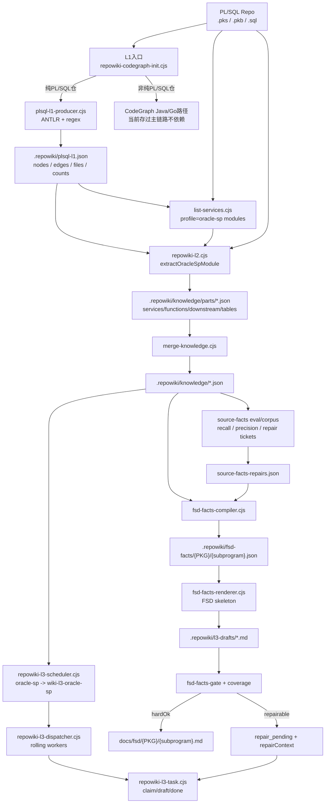
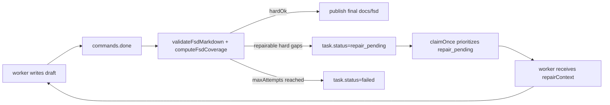
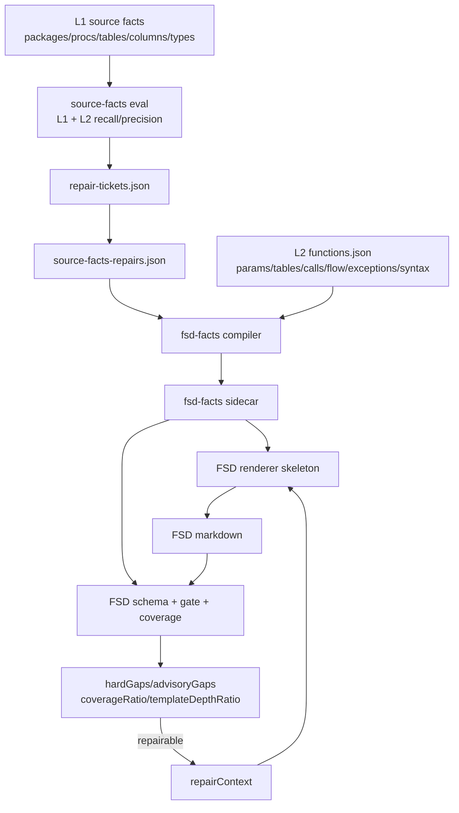

# Repowiki SQL 存过 FSD 当前链路设计

> 范围：本文只描述 Oracle PL/SQL 存储过程到中间 FSD/wiki 的链路，不包含 Dubbo、UA、Java 最终代码生成。
> 基线目录：`D:\07.program\lixi-repo\lingxicode-offline-v1.4.6-win10-x64-skills-0615\lingxicode-offline-v1.4.6-win10-x64-skills-0626\lingxicode-offline-v1.4.6-win10-x64-skills`

## 1. 当前结论

当前存过链路已经具备端到端骨架：

```text
PL/SQL 源码
-> L1 plsql-l1.json
-> L2 oracle-sp facts
-> merge knowledge
-> L3 wiki-l3-oracle-sp function-doc task
-> fsd-facts sidecar + FSD draft
-> FSD gate / repairContext
-> docs/fsd/{PKG}/{subprogram}.md
```

但必须明确：PL/SQL 链路不是使用 Java/Go CodeGraph 建图；`repowiki-codegraph-init.cjs` 对纯 PL/SQL 仓会跳过 CodeGraph，改为调用 `plsql-l1-producer.cjs` 生成 `.repowiki/plsql-l1.json`。L2 也不是完全消费 L1 图事实，它仍然在 `extractOracleSpModule()` 中对 `.pks/.pkb/.sql` 文本做脚本扫描和正则解析。因此，L1/L2 靠脚本配置确实存在漏掉存过要求内容的风险，不能宣称“天然全量”。

## 2. 源码证据

| 主题 | 源码位置 | 说明 |
|---|---|---|
| PL/SQL 跳过 CodeGraph | `config/skills/repowiki/repowiki-codegraph-init.cjs` 的 `isPlsqlOnlyRepo()`、`runPlsqlL1Producer()` | 纯 PL/SQL 仓检测到 `.pks/.pkb/.sql` 且无 Java/Go 时，运行 `plsql-l1-producer.cjs`，写 `.repowiki/plsql-l1.json` 和 `.repowiki/codegraph-init.json`。 |
| PL/SQL L1 事实底座 | `config/skills/repowiki/lib/plsql-l1-producer.cjs` | 扫描 spec/body/DDL/standalone function/trigger/type，输出 nodes、edges、files、counts。ANTLR 可用时使用 ANTLR + regex，缺失时 regex-only。 |
| L2 切换 L1 | `config/skills/repowiki/repowiki-l2.cjs` 的 `_reloadL1ForPlsql()` | oracle-sp 仓读 `plsql-l1-adapter.cjs`，把 L1 切到 `.repowiki/plsql-l1.json`。 |
| L2 oracle-sp 抽取 | `config/skills/repowiki/repowiki-l2.cjs` 的 `extractOracleSpModule()` | 抽 Package、Procedure、Function、参数、返回值、表操作、序列、常量、控制流、异常、特殊语法、跨包调用。 |
| L3 skill 映射 | `config/skills/repowiki/repowiki-l3-scheduler.cjs` | `oracle-sp` profile 映射到 `wiki-l3-oracle-sp`。 |
| L3 输出路径 | `config/skills/repowiki/repowiki-l3-task.cjs` 的 `preferredFunctionDocOutputByFacts()` | oracle-sp 不依赖功能清单 rows，直接按 L2 function facts 输出 `docs/fsd/{PKG}/{subprogram}.md`。 |
| FSD facts 合同 | `config/skills/repowiki/lib/fsd-facts-compiler.cjs`、`fsd-facts-schema.cjs` | 将 L2 function facts 编译成 `fsd-facts`，作为 L3 文档生成和验收的同源事实。 |
| FSD renderer | `config/skills/repowiki/lib/fsd-facts-renderer.cjs` | 生成 6 板块 FSD skeleton，包含参数表、返回值、表/列映射、依赖、业务规则、控制流、异常、事务、特殊语法。 |
| FSD gate | `config/skills/repowiki/lib/fsd-facts-gate.cjs`、`fsd-facts-coverage.cjs` | 已拆分 hard/advisory；硬门禁卡结构和确定事实，解释性字段进入 advisory。 |
| L3 repair 循环 | `config/skills/repowiki/repowiki-l3-task.cjs` 的 `rejectDoneState()`、`claimOnce()` | repairable done 拒绝后进入 `repair_pending`，下一次 claim 携带 `repairContext`，避免普通 pending 抢占。 |
| source-facts 评测 | `config/skills/repowiki/plsql-source-facts-eval.cjs`、`plsql-source-facts-corpus.cjs` | 对 `.repowiki/plsql-l1.json` 和 `.repowiki/knowledge/functions.json` 做 recall/precision、repair tickets、GitHub corpus 报告。 |

## 3. 总体架构图



## 4. 分层数据流与产物

### 4.1 L1：PL/SQL 事实底座

输入：
- `.pks`、`.pkb`、`.sql`
- 目录和文件名模式，用于区分 spec/body/DDL/function/trigger/type

处理：
- `plsql-l1-producer.cjs` 扫描文件。
- package spec 抽 package/procedure/function/type。
- DDL 抽 table/column/sequence。
- body 用 regex 补 contains/calls 等边。

输出：
- `.repowiki/plsql-l1.json`
- `.repowiki/codegraph-init.json`

下游使用：
- L2 通过 `plsql-l1-adapter.cjs` 读取 L1 nodes。
- L2 在表操作抽取后，用 L1 table nodes 回填 columns。
- source-facts eval 直接读取 `.repowiki/plsql-l1.json`。

当前限制：
- 只有纯 PL/SQL 仓会走这条路径；混合 Java + PL/SQL 仓可能进入普通 CodeGraph 路径。
- 文件分类依赖后缀和路径/文件名启发式，未知布局可能漏分。
- body 语义仍有 regex 补充，复杂动态 SQL、嵌套块、重载、cursor、bulk 行为不保证全覆盖。

### 4.2 list：模块与 profile 发现

输入：
- 源码目录
- 内置 profile 列表，包含 `oracle-sp`

处理：
- `list-services.cjs` 枚举模块。
- oracle-sp profile 识别 package/procedure/function。

输出：
- `.repowiki/modules.json`

下游使用：
- `repowiki-l2.cjs --all` 根据 modules 逐模块抽取 facts。
- `repowiki-l3-scheduler.cjs` 根据 module profile 推断 L3 skill。

### 4.3 L2：oracle-sp facts 抽取

输入：
- `.repowiki/plsql-l1.json`
- `.repowiki/modules.json`
- PL/SQL 源码文本

处理：
- `extractOracleSpModule()` 将 Package 映射为 service，将 Procedure/Function 映射为 function。
- 抽取参数、返回值、`oracle_params`、`input_types`。
- 抽取 `table_facts`、`sequence_deps`、`constant_deps`、`cross_package_calls`。
- 抽取 `control_flow`、`exception_handlers`、`special_syntax`。
- 用 L1 table node columns 回填表字段。

输出：
- `.repowiki/knowledge/parts/{module}.json`
- 合并后进入 `.repowiki/knowledge/functions.json`、`services.json`、`downstream.json`、`tables.json` 等。

指标：
- source-facts eval 对函数事实做 recall/precision。
- repair tickets 可转为 `source-facts-repairs.json`，后续编译 fsd-facts 时 overlay。

当前限制：
- L2 不是“只消费 L1”；它仍然读源码做脚本抽取。
- L1 nodes 与 L2 facts 之间不是全量 lineage 驱动，部分事实来自 L2 二次扫描。
- 没有 golden 时，source-facts gate 默认是 advisory，不阻断生产链路。

### 4.4 merge：知识合并

输入：
- L2 parts

输出：
- `.repowiki/knowledge/functions.json`
- `.repowiki/knowledge/services.json`
- `.repowiki/knowledge/downstream.json`
- `.repowiki/knowledge/tables.json`
- `.repowiki/knowledge/source-facts-repairs.json`（可选）

下游使用：
- L3 scheduler/task 从 knowledge 读取 function facts。
- fsd-facts compiler 从 function facts + repairs 编译 FSD 合同。

### 4.5 L3：FSD 文档生成

输入：
- `.repowiki/knowledge/functions.json`
- `wiki-l3-oracle-sp/manifest.json`
- `wiki-l3-oracle-sp/rules/*`
- `fsd-facts` sidecar

处理：
- scheduler 生成 function-doc tasks。
- task claim 时生成 `fsd-facts` 和 `renderedSkeleton`。
- worker 应以 skeleton 为基础补语义说明、业务摘要、Java 映射建议等解释性内容。
- done 时校验 draft 并发布 final。

输出：
- draft：`.repowiki/l3-drafts/*.md`
- sidecar：`.repowiki/fsd-facts/{PKG}/{subprogram}.json`
- final：`docs/fsd/{PKG}/{subprogram}.md`
- 诊断：`.repowiki/diagnostics/*`

### 4.6 Gate 与 repair 循环

FSD gate 分两类：

| 类型 | 内容 | 行为 |
|---|---|---|
| hard | 路径安全、章节顺序、空文档、模板残留、schema、身份事实、参数、返回值、表/列、调用、控制流、异常、事务、特殊语法、manual review 等确定事实 | 不通过则不发布 final，进入 repair 或 failed |
| advisory | Java 类型建议、业务规则描述、解释性映射等非确定语义 | 记录为 advisory，不直接把生产链路卡死 |

repair 机制：



这条链路的设计意图是：门禁用于反馈和定向修复，不是把可修问题直接硬停；final 目录只接收通过 hard gate 的文档，避免半成品混入。

## 5. 指标继承关系



关键指标：

| 指标 | 产生位置 | 作用 | 是否已进入 L3 验收 |
|---|---|---|---|
| packages/procedures/functions/tables/columns/types | `plsql-l1.json` | L1 底层事实覆盖 | 间接进入，主要通过 L2 + fsd-facts |
| source-facts recall/precision | `plsql-source-facts-eval.cjs` | 验 L1/L2 事实召回与精度 | 部分进入；有 repair overlay，但默认生产链路无 golden 时 advisory |
| fsd-facts schema ok | `fsd-facts-schema.cjs` | 验 sidecar 合法 | 已进入 L3 hard gate |
| hardGaps | `fsd-facts-gate.cjs` / `coverage.cjs` | 确定事实缺失 | 已进入 L3 repair/fail |
| advisoryGaps | 同上 | 解释性质量缺口 | 已记录，不硬停 |
| coverageRatio | `computeFsdCoverage()` | diagnostic token 覆盖率 | 已记录，辅助诊断 |
| templateDepthRatio | `computeFsdCoverage()` | FSD 模板深度覆盖 | 已记录；hard/advisory 拆分后用于 repairContext |

## 6. 已完成修复

### 6.1 FSD gate 不再把 repairable 缺口直接生产硬停

已实现：
- hard/advisory 拆分。
- `UNKNOWN`/空值不再反向否定 worker 的合理补全。
- repairable done 拒绝后进入 `repair_pending`。
- 下一轮 claim 携带 `repairContext`，避免 worker 自诊断和重 claim 混乱。
- final 只发布通过 hard gate 的文档。

验证：
- `fsd-facts-gate.test.cjs`
- `fsd-l3-integration.test.cjs`
- `fsd-template-depth-mutation.test.cjs`

### 6.2 本轮新增：PL/SQL L1 producer 不再重复执行

问题：
- `repowiki-codegraph-init.cjs` 的 PL/SQL 快捷路径原先先 `spawnSync` 跑一次 producer，再 `require(...).produce(repo)` 跑一次 producer，只为拿 counts 写 state。

修复：
- 改为只 `require` producer 并调用一次 `produce(repo)`，返回值直接写 state。

验证：
- `config/skills/repowiki/tests/plsql-codegraph-init.test.cjs`
- RED：修复前 producer backend 日志出现两次。
- GREEN：修复后只出现一次，且 `.repowiki/plsql-l1.json` 与 `codegraph-init.json` 正确写入。

## 7. 仍未完全修复的内容

| 缺口 | 当前状态 | 影响 | 建议边界 |
|---|---|---|---|
| 生产 LLM Judge 未落地 | 当前只有确定性 hard/advisory gate，`eval/score-l3.cjs` 只把 LLM 语义层标为待 judge/人审 | 无法自动判断“业务规则描述是否足够好” | P1：接入结构化 LLM Judge，输出 `pass/needs_repair/needs_l2_fact/needs_review`，但不能替代 hard gate |
| source-facts 无 golden 时不自动补全 | 默认生产 run 里是 WARN/advisory，只有 `--source-facts-golden` 和 `--source-facts-apply-repair-tickets` 时形成闭环 | 大仓没有 golden 时，L2 召回缺口可能进入 L3 | P1：引入抽样 golden/corpus 基线和项目级 source-facts policy |
| L1/L2 对 PL/SQL 完整性仍依赖脚本扫描 | L1 使用 ANTLR + regex，L2 又二次读源码抽过程体、SQL、控制流 | 动态 SQL、复杂嵌套、重载、cursor、条件编译等可能漏 | P0/P1：扩大 corpus 与 mutation，补 unresolved ledger；中期把 L2 更彻底改为消费 L1 结构事实 |
| 混合仓 PL/SQL 快捷路径不覆盖 | `isPlsqlOnlyRepo()` 要求 Java/Go 计数为 0 | Java + PL/SQL 混合仓可能不生成 `plsql-l1.json` | P1：改为“检测 PL/SQL 即并行生产 plsql-l1”，不与 CodeGraph 互斥 |
| FSD 业务规则质量仍依赖 worker | renderer 提供 skeleton，但业务摘要/规则归纳仍需 LLM 补充 | 首稿质量受模型和 prompt 影响 | P1：把 worker 输入压缩为 fsd-facts + repairContext + rules 摘要，避免读全局文件；并加入 LLM Judge 抽检 |

## 8. L1/L2 靠脚本配置是否会漏

会。原因不是“脚本写得差”，而是 PL/SQL 存过要求覆盖的语义天然超出简单脚本扫描：

1. 文件分类风险：当前 L1 `scanFiles()` 依赖后缀和目录/文件名启发式。真实项目中 package body、DDL、trigger、type、anonymous block 可能混在同一 `.sql` 文件。
2. 过程边界风险：L2 用 `PROCEDURE/FUNCTION ... IS|AS` 和 `BEGIN/CASE/END` 计数找 body，遇到复杂嵌套、条件编译、重载、声明区匿名块，可能截断或吞后续过程。
3. SQL 抽取风险：`parseTableOps()` 覆盖常见 DML，但动态 SQL、CTE、子查询 alias、schema.table、dblink、临时表、视图、同义词、批量绑定不保证完整。
4. 控制流风险：当前控制流是按行识别 IF/ELSIF/ELSE/FOR/WHILE/LOOP/FORALL/MERGE/EXCEPTION/WHEN/RAISE/COMMIT/ROLLBACK，缺少完整 AST 控制流图。
5. 业务规则风险：校验规则、计算逻辑、状态流转、边界条件不是纯语法事实，脚本只能提供候选，仍需 LLM 或人工基于上下文归纳。
6. 依赖风险：跨包调用和常量依赖靠文本模式过滤 SQL alias，仍可能误判或漏判。

因此当前正确口径是：
- L1/L2 脚本能稳定覆盖一批明确语法事实。
- 它不是完整语义证明。
- 必须用 source-facts corpus、golden、mutation、unresolved/repair ledger 和 LLM Judge 收敛风险。

## 9. 后续治理方案

### P0：保持当前已修机制不倒退

- final 文档必须由 hard gate 通过后发布。
- repairable 缺口必须进入 `repair_pending + repairContext`，不能 reset 普通 pending。
- source-facts gate 在生产默认可 advisory，但 gate-only/strict 模式必须失败并给 repair tickets。
- PL/SQL L1 producer 只能执行一次。

### P1：让 L1/L2 从“脚本配置”升级为“事实 + 不确定项账本”

建议新增或强化：
- `plsql-file-inventory.json`：记录全部 `.sql/.pks/.pkb` 文件分类、命中原因、未分类原因。
- `plsql-unresolved.json`：记录未解析过程、未闭合 block、动态 SQL、未解析表/列、未解析跨包调用。
- mixed repo 并行 L1：只要仓内存在 PL/SQL，就生成 `plsql-l1.json`，不要与 Java/Go CodeGraph 互斥。
- L2 事实必须标注 source：`l1-node`、`l2-regex`、`repair-overlay`、`manual-review`。

### P1：引入 LLM Judge，但不替代确定性 gate

LLM Judge 输入：
- `fsd-facts`
- FSD Markdown
- `wiki-l3-oracle-sp/rules/FSD生成规约.md`
- `repairContext`（如有）

LLM Judge 输出：
- `pass`
- `needs_repair`
- `needs_l2_fact`
- `needs_review`
- 精确修复点和证据引用

原则：
- hard gate 负责事实和结构。
- LLM Judge 负责语义充分性、业务规则描述、迁移建议是否合理。
- Judge 不能把缺失事实判成通过；缺失事实必须回 L2/source-facts。

### P2：扩大评测集

评测集必须覆盖：
- package spec/body
- standalone procedure/function
- trigger
- DDL table/columns/sequences
- dynamic SQL
- cursor/open for
- bulk collect/forall/save exceptions
- merge
- exception/sqlcode/sqlerrm
- commit/rollback/autonomous transaction
- constants/type record/table of
- conditional compilation
- cross-package call/constant/type

验收输出：
- `source-facts-corpus-report.json`
- 每 case recall/precision
- repair tickets
- FSD markdown coverage
- mutation report

## 10. 当前可上线判断

就“已有 PL/SQL 存过仓生成 FSD 中间文档”的骨架能力看，当前链路具备可试运行条件；就“保证存过方案要求全量充分输出”看，仍不能宣称完备上线。

可上线边界：
- 用于受控试点、带诊断和人工复核的 FSD 生成。
- 对有 golden/corpus 的项目可以启用 strict source-facts gate。
- 对无 golden 的大仓，必须把 source-facts 报告、hard/advisory gaps、manual review 作为交付的一部分。

不可宣称：
- 不能宣称 L1/L2 对所有存过语义全量覆盖。
- 不能宣称业务规则质量已自动超过人工/专家方案。
- 不能宣称混合 Java + PL/SQL 仓已完整覆盖。
